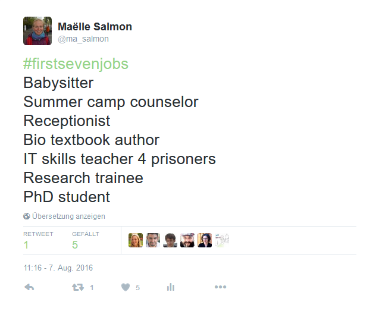

```{r setup, include=FALSE}
knitr::opts_chunk$set(echo = FALSE)
library("dplyr")
```


Have you tweeted about your "#firstsevenjobs"? I did!



“#firstsevenjobs" and “#first7jobs" tweets initial goal was to provide a short description of the 7 first activities they were paid for. It was quite fun to read them in my timeline! Of course the hashtag was also used by spammers, for making jokes, and for advertising for analyses in R, so not all the tweets contain the 7 descriptions. 

However, I am confident quite a lot of “#firstsevenjobs" and “#first7jobs" actually describe first jobs, so I decided to use them as example of text analysis in R, starting from querying Twitter API with the rtweet package, then cleaning the tweets a bit, and then using the Monkeylearn package to classify the jobs in an industry.

```{r, echo = FALSE}
load("data/first7jobs.RData")
load("data/parsed_first7jobs.RData")
```

# Getting the tweets

I used the [`rtweet` R package](https://github.com/mkearney/rtweet/) for getting tweets via the Twitter API, searching for both “#firstsevenjobs" and “#first7jobs" hashtags and then keeping only unique non-retweeted tweets. I got `r nrow(first7jobs)` tweets. This does not mean there were only that few tweets produced with the hashtags, but the Twitter API does not output aaall the tweets. You'd have to pay for it. But hey that's a good number of tweets to start with, so I won't complain. Here is part of the table I got:

```{r}
set.seed(1)
knitr::kable(first7jobs[sample(1:nrow(first7jobs), 10),])
```

So you see, part of them contains actual job descriptions, others don't... I mean, even I polluted the hashtag for advertising my own analysis! Among those that do describe jobs, some use commas or new lines between descriptions, or number them, or simply use spaces... Therefore, parsing tweets for getting 7 job descriptions per tweet was a little challenge. 

I counted the number of possible separators for finding which one I should probably use to cut the tweet into 7 part. This yielded tweets cut in several parts... sometimes less than 7, sometimes more. I could not parse tweets whose descriptions were separated only by spaces because words inside a description are separated by spaces too so I could not make the difference. Besides, some people have tweeted about less or more than 7 packages. For instance one tweet says I have not had seven jobs yet but so far...\n- Accounts Assistant\n- Executive PA\n- Social Media Lead\n\nNext,yoga instructor?\n  #FirstSevenJobs". I did my best to remove tweet parts that were something like "Here are my #firstsevenjobs", in order to keep only the job descriptions. At the end I kept only the tweets that had exactly 7 parts. 

Out of `r nrow(first7jobs)` I got `r nrow(first7jobs_parsed) / 7` tweets, that is `r nrow(first7jobs_parsed)` job descriptions. That is *a lot*. Here is an excerpt of the table:

```{r}
set.seed(1)
select(first7jobs_parsed, status_id, wordsgroup) %>%
  head(n = 21) %>%
  knitr::kable()
```

 It would take a long time to read them all the tweets, although I did end up reading a lot of tweets while preparing this post. I wanted to have a general idea of what people did in their life. I turned to machine learning to help me get some information out of the tweets. I'm the creator and maintainer of an [R package called monkeylearn](https://github.com/ropenscilabs/monkeylearn), which is part of the [rOpenSci project](http://ropensci.org/), that allows to use existing Monkeylearn classifiers and extractors, so I knew that Monkeylearn had a [cool job classifier](https://app.monkeylearn.com/main/classifiers/cl_i7vMzUB7/). I sent all the `nrow(first7packages_parsed)` job descriptions to Monkeylearn API.
 
```{r}
library("dplyr")
library("tidyr")
library("ggplot2")
library("viridis")
load("data/output.RData")
load("data/parsed_first7jobs.RData")
```

Monkeylearn's job classifier assigns an industry and a probability to each job description. ASK FEDERICO FOR MORE DETAILS ABOUT THE CLASSIFIER, TRAINING DATA, PROBABILITY MEANINING, ETC.

```{r}
# Output has same length as request, so here no need to join by MD5.

output_with_words <- bind_cols(output, first7jobs_parsed)


filter(output_with_words,
       probability > 0.5) %>%
  ggplot() +
  geom_bar(aes(label))+
  theme(axis.text.x = element_text(angle = 45, hjust = 1)) +
  scale_fill_viridis(discrete = TRUE)
```


Note that my whole code is [in this Github repo](https://github.com/masalmon/first_7_jobs). I used those R packages: rtweet, dplyr, tidyr, ggplot2, stringr, circlize and of course monkeylearn. Thanks a lot to their authors, and obviously thanks to people whose tweets I used... I might be a *little bit* more grateful to people who used separators and only posted 7 tweets. If you want to read another "#first7" analysis in R, I highly recommend [David Robinson's post](http://varianceexplained.org/r/seven-fav-packages/) about the "7FavPackages" hashtag.


